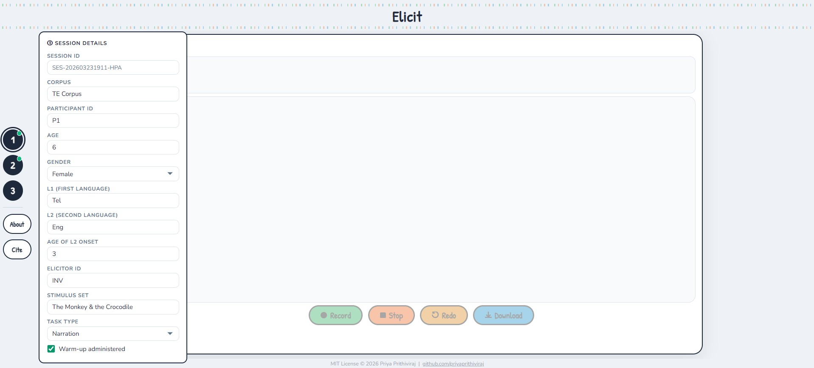
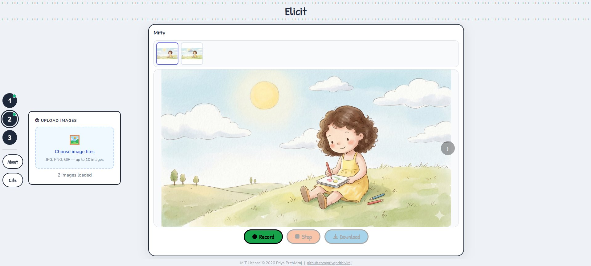
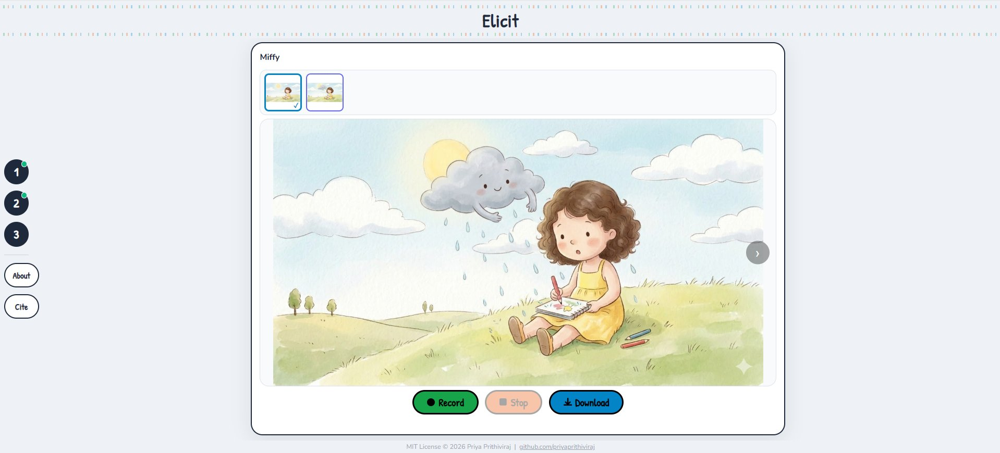

# Elicit

Elicit is a browser-based instrument for the collection of spoken language samples using pictorial stimuli. It is intended for researchers, clinicians, and educators who require a lightweight, portable solution for eliciting and recording spoken language samples across a sequence of images. The tool runs as a single HTML file and requires no installation, server infrastructure, or internet connection during use. All audio recording, processing, and file export are performed locally within the browser; no participant data is transmitted to any external system at any point.

The tool was developed with cross-linguistic and multilingual research contexts in mind. Session metadata (including participant demographics, language background, elicitor information, stimulus set, and task type) is recorded alongside audio onset and offset timestamps in a single exportable CSV file. A CLAN-compatible CHAT header file is generated automatically from the session metadata, reducing the manual preparation required before transcription.

## System Requirements

A standards-compliant browser with support for the Web Audio API and MediaRecorder (Chrome or Edge version 90 or later is recommended; Firefox and Safari are also supported). Microphone access is required and must be granted by the user. The file must be opened as a local file or served over HTTPS for microphone access to function; this constraint is imposed by browser security policy, not by the tool itself.

## How to Use

**Step 1: Before recording, click on button 1 and enter the session metadata into the Session Details panel. A session ID is generated automatically in the format SES-{timestamp}-{random}, but it can be edited. There is a checkbox to record whether any warm-up protocol was administered. All metadata fields are optional but are recommended for research use, as they populate both the CSV output and the CHAT header.**

**Step 2: Click on button 2 and upload the stimulus images from the local file system (JPG, PNG, or GIF format). The images are sorted alphanumerically upon loading and presented in a forward-only carousel to prevent inadvertent re-exposure to earlier stimuli. However, individual images can be displayed or deleted by hovering over the thumbnail and selecting the control, provided recording is not in progress.**

**Step 3: Click on the Record button to initiate audio capture via the device microphone. A timer will display the elapsed recording time. Click on the Stop button to terminate recording and save the audio for the current session. A tick mark on the thumbnail indicates a completed recording for that image. The Redo button will replace the recording for the current image following user confirmation. Recording will continue across images unless manually stopped; to produce a separate file per image, the user should stop recording after each image before advancing.**

**The Notes panel, displayed to the right of the image viewer, can be used to note down observations. The notes are stored per image and are written to the session CSV on export. Click on the Play button for a playback of the current audio recording to verify audio quality before downloading.**

**Click on the Download button to export all the output files for the session (see Output section). The autosave state will be cleared following a successful download. The Reset button, displayed in the session bar once images have been loaded, clears all recordings, images, and metadata. If recordings are present, the user is prompted to download before proceeding.**

---

## Output

Three file types are exported per session.

**1. WAV audio files** 

One file per image, recorded in mono at 16-bit PCM, 44,100 Hz. Files are named sequentially as {ParticipantID} _ image_01.wav, {ParticipantID} _ image_02.wav, etc. This format is compatible with CLAN, Praat, and SALT.

**2. Session CSV ({ParticipantID}_session.csv)** 

One row per image. The file contains the following columns: session_id, corpus, participant_id, age, gender, l1, l2, l2_onset, elicitor_id, stimulus_set, task_type, warmup, date, image_number, filename, onset_ms, offset_ms, duration_ms, notes. Onset and offset times are recorded in milliseconds relative to the first recording event in the session.

**3. CHAT header file ({ParticipantID}.cha)** 

A header file in CLAN CHAT format, pre-populated with @Languages, @Corpus, @Participants, @ID lines for both the child participant (CHI) and investigator (INV), @Media, @Date, and @Situation. The corpus field in the CHAT header is drawn from the Corpus entry in the Session Details panel. The user can add the transcript below the header and before the @End line. Elicit runs entirely in the browser as a single HTML file with no installation, server, or internet connection. Users can upload picture stimuli, record participant responses, and download the audio as WAV files for subsequent analysis.

---

## Notes for Researchers

Elicit does not transmit data. Audio recording, processing, and export are performed entirely within the browser environment on the researcher's device. The tool does not retain session data between uses. An autosave mechanism writes session metadata and notes to the browser's localStorage as a safeguard against data loss; this stored data is cleared automatically following a successful download or session reset. The WAV format was chosen for compatibility with speech analysis software, including CLAN, Praat, and Audacity. The recording is mono, 16-bit, at 44,100 Hz.

Researchers are responsible for obtaining appropriate ethical approval and informed consent from participants or their guardians before use.

---

## Citation

If you use Elicit in research or adapt it for your own work, please cite:

> Prithiviraj, P. (2026). Elicit: A picture-based elicitation tool (Version 1.0) [Computer software]. https://priyaprithiviraj.github.io/elicit

---

## License

MIT License © 2026 Priya Prithiviraj. See LICENSE for full terms.
